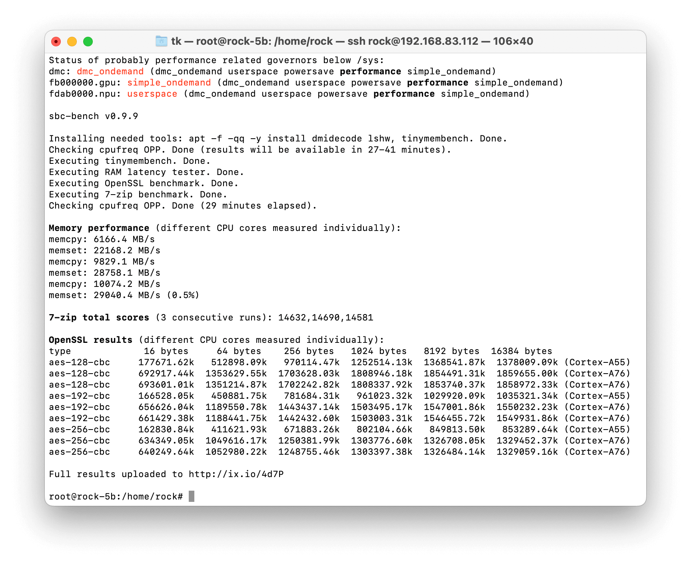
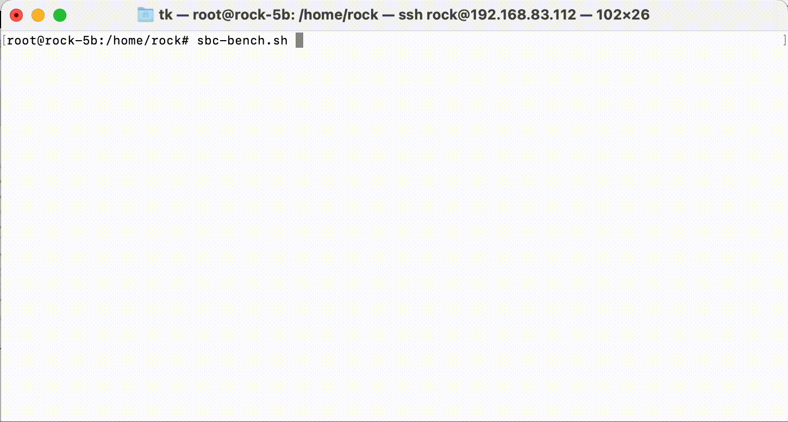

# sbc-bench

SBC is a shortcut for [single-board computer](https://en.wikipedia.org/wiki/Single-board_computer) and this whole repository is about performance considerations around those devices (with an initial focus on energy efficient server tasks).

This small set of different CPU performance tests focuses on 'headless' operation only (no GPU/display stuff, no floating point number crunching). Unlike many other 'kitchen-sink benchmarks' it tries to produce insights instead of fancy graphs.

It has eight **entirely different** usage modes:

* Generate a rough CPU performance assessment for a specific SBC *in general* (under ideal conditions)
* Show whether an *individual* SBC is able to perform the same and if not hopefully answering the question 'why?'
* Help software developers and hardware designers to improve 'thermal performance' when using the `-t` and/or `-T` switches ([details/discussion](https://forum.armbian.com/topic/7819-sbc-bench/?do=findComment&comment=60873), [another example](https://forum.armbian.com/topic/8125-quick-review-of-nanopi-k1-plus/?do=findComment&comment=61300))
* Graph thermal/consumption charts with `-g` to [measure efficiency of settings/devices](Efficiency_Graphing.md)
* Generate a controlled environment with appropriate settings for other benchmark suites like Geekbench (`sbc-bench -G`) or Phoronix (`sbc-bench -P`)
* `sbc-bench -k` shows kernel version info. Stuff like: still supported? BSP or mainline?
* The review modes (`-r` and `-R`) are designed to help reviewers and participants of 'SBC debug parties' to quickly identify tunables and bottlenecks that need further attention: reports many performance relevant settings, switches them to max performance and lurks from then on in the background to monitor other benchmark executions and tests. By comparing scores made with defaults we are able to directly identify settings that need adjustments
* Provide basic CLI monitoring functionality through the `-m` switch

The monitoring now also displays some hardware information when starting:

    tk@odroidxu4:~$ sbc-bench -m
    Samsung Exynos EXYNOS5800 rev 1, Exynos 5422, Kernel: armv7l, Userland: armhf
    CPU sysfs topology (clusters, cpufreq members, clockspeeds)
                     cpufreq   min    max
     CPU    cluster  policy   speed  speed   core type
      0        1        0      200    1400   Cortex-A7 / r0p3
      1        1        0      200    1400   Cortex-A7 / r0p3
      2        1        0      200    1400   Cortex-A7 / r0p3
      3        1        0      200    1400   Cortex-A7 / r0p3
      4        0        4      200    2000   Cortex-A15 / r2p3
      5        0        4      200    2000   Cortex-A15 / r2p3
      6        0        4      200    2000   Cortex-A15 / r2p3
      7        0        4      200    2000   Cortex-A15 / r2p3
    
    Thermal source: /sys/devices/virtual/thermal/thermal_zone0/ (cpu0-thermal)
    
    Time       big.LITTLE   load %cpu %sys %usr %nice %io %irq   Temp
    18:18:33:  800/ 500MHz  0.00  18%   0%  17%   0%   0%   0%  25.0°C
    18:18:38:  800/ 600MHz  0.00   0%   0%   0%   0%   0%   0%  24.0°C
    18:18:43:  700/ 500MHz  0.07   0%   0%   0%   0%   0%   0%  24.0°C
    18:18:48:  800/ 600MHz  0.07   0%   0%   0%   0%   0%   0%  24.0°C
    ^C

The SoCs (system-on-chip) used on today's SBC are that performant that heat dissipation when running full load for some time becomes an issue. The strategies to deal with the problem differ by platform and kernel. We've seen CPU cores being shut down when overheating (Allwinner boards running with original Allwinner software), we know platforms where throttling works pretty well but by switching to a different kernel performance is trashed on exactly the same hardware. Sometimes it's pretty easy to spot what's going on, sometimes vendors cheat on us and it takes some efforts to get a clue what's really happening.

This tool therefore focuses on a controlled environment and intensive monitoring running in the background and being added to results output. The tool returns with a brief performance overview (see screenshot above) but the real information will be uploaded to an online pasteboard service ([Rock 5B example](http://ix.io/41BH)). Without checking this detailed output numbers are worthless (since we always need to check what really happened).

## Execution

You need Debian Stretch/Buster/Bullseye/Bookworm or Ubuntu Bionic/Focal/Jammy. Older variants are not supported (due to distro packages being way too outdated). Then it's

    wget https://raw.githubusercontent.com/ThomasKaiser/sbc-bench/master/sbc-bench.sh
    sudo /bin/bash ./sbc-bench.sh -c

Unfortunately to adjust the cpufreq governor and to collect monitoring data execution as root is needed. So do **not** run this on productive systems or if you don't understand what the script is doing.

## Which tools are used and why?

I chose [mhz](https://github.com/wtarreau/mhz), [tinymembench](https://github.com/nuumio/tinymembench), [ramlat](https://github.com/wtarreau/ramspeed), [cpuminer](https://github.com/tkinjo1985/cpuminer-multi.git), [stockfish](https://stockfishchess.org), [7-zip](https://www.7-cpu.com) and [OpenSSL](https://www.openssl.org)'s AES benchmarks for the following reasons:

### [mhz](https://github.com/wtarreau/mhz)

This tool is not a benchmark but instead measures real CPU clockspeeds. This is helpful on platforms where cpufreq support is not available yet or we can not rely on the clockspeed values returned by the kernel. This applies to platforms where vendors are cheating (RPi, Amlogic) or where actual clockspeeds are set via jumpers while the clockspeeds available to the kernel are derived from device-tree (DT) entries. On a Clearfog Pro routerboard it will look like this for example (DT defines 666/1332 MHz while I configured 800/1600 MHz via jumper):

    Checking cpufreq OPP:

    Cpufreq OPP: 1332    Measured: 1599 (1598.621/1598.759/1598.324) (+20%)
    Cpufreq OPP:  666    Measured:  799    (799.502/798.295/799.115) (+20%)

We call `mhz` twice. At the begin of the benchmark with an idle and cold system walking through all cpufreq OPP and directly after the most demanding benchmark has finished with the device still under full load to see whether behaviour changes when SoC is overheated. This is on a [Thundercomm Dragonboard 845c](http://ix.io/4dJV). Prior to benchmark execution it looked like this:

    Checking cpufreq OPP for cpu4-cpu7 (Qualcomm Kryo 3XX Gold):

    Cpufreq OPP: 2803    Measured: 2704 (2705.057/2704.717/2704.717)     (-3.5%)
    Cpufreq OPP: 2649    Measured: 2704 (2704.830/2704.717/2704.717)     (+2.1%)

When running the multi-threaded 7zip benchmark, the SoC temperature exceeds 80°C and afterwards the 2803 MHz cpufreq OPP is gone while the reported 2649 MHz are in reality only ~1940:

    Checking cpufreq OPP for cpu4-cpu7 (Qualcomm Kryo 3XX Gold):

    Cpufreq OPP: 2649    Measured: 1940 (1955.570/1943.795/1922.274)    (-26.8%)

### [tinymembench](https://github.com/nuumio/tinymembench)

Unlike other 'RAM benchmarks' *tinymembench* checks for both memory bandwidth **and** latency in a lot of variations so it's even possible to get some insights about internal cache sizes. It also measures each mode at least two times and if sample standard deviation exceeds 0.1%, it is shown in brackets next to the result. So it's pretty easy to spot background activity ruining benchmark results.

On hybrid systems with different CPU cores (big.LITTLE, DynamicIQ, Alder/Raptor Lake) we pin execution one time to an efficiency/little and one time to a performance/big core to know the difference this makes. For the sake of simplicity we output *memcpy* and *memset* numbers at the end of the benchmark. On an *overclocked* RPi 3 B+ (arm_freq=1570, over_voltage=4, core_freq=500, sdram_freq=510, over_voltage_sdram=2) this will look like this

    Memory performance:
    memcpy: 1316.0 MB/s (0.8%)
    memset: 1933.9 MB/s

On a NanoPC T4 (RK3399, 2xA72/4xA53 CPU cores) this will look like this with mainline kernel and conservative settings *without any optimizations* yet:

    Memory performance:
    memcpy: 2054.9 MB/s
    memset: 8453.0 MB/s (0.2%)
    memcpy: 4238.8 MB/s (0.4%)
    memset: 9082.5 MB/s (0.9%)

*(first two lines show execution on a little A53 core, the last ones when pinned to an A72 big core)*

On ARM SoCs CPU and GPU/VPU usually share memory access so it's worth a try to experiment with disabling HDMI/GPU for headless use cases. Often memory bandwidth and therefore overall performance increases. Same when switching between kernel branches.

### [ramlat](https://github.com/wtarreau/ramspeed)

Provides some insights about cache sizes/speed and memory latency/bandwidth. Stuff [like this](https://www.cnx-software.com/2021/03/04/rockchip-rk3566-tv-box-h96-max-android-11/#comment-581346).

### [cpuminer](https://github.com/tpruvot/cpuminer-multi)

Prior to adding [stockfish](#stockfish) on most platforms this was the most demanding benchmark of the six and pretty efficient to check for appropriate heat dissipation and even instabilities under load. It makes heavy use of [SIMD optimizations](https://en.wikipedia.org/wiki/SIMD) (NEON on ARM and SSE/AVX on x86) therefore generating more heat than unoptimized 'standard' code.

Heavy SIMD optimizations aren't really common, the generated scores depend a lot on compiler version and therefore this test is optional. Unless you execute `sbc-bench -c` or with `MODE=extensive` it will be skipped since results can be misleading. So consider this being a load generator to check whether your board will start to throttle or becomes unstable but take the benchmark numbers with a grain of salt unless you're a programmer and know what [NEON](https://en.wikipedia.org/wiki/ARM_architecture#Advanced_SIMD_(NEON)),  [SSE](https://en.wikipedia.org/wiki/Streaming_SIMD_Extensions) and [AVX](https://en.wikipedia.org/wiki/Advanced_Vector_Extensions) really are and whether your application can make use of.

A typical result (Rock 5B with Ubuntu Focal) will look like this:

    Cpuminer total scores (5 minutes execution): 25.32,25.31,25.30,25.29,25.28,25.12 kH/s

*(result variation in this case is ok since all results are more or less the same. If the board would've started throttling or heavy background activitiy would've happened the later numbers would be much lower than the first ones)*

### [stockfish](https://stockfishchess.org)

Stockfish (open source chess engine) also makes heavy use of SIMD extensions but is heavy on memory access too putting even more load on devices than cpuminer which doesn't access RAM that much or at all since working set fits inside CPU caches.

As with cpuminer this test is optional (`sbc-bench -s` or `MODE=extensive` needed) since not representing any broader use case but being more of a stressor / load generator exposing thermal and stability issues. Consumption figures are higher compared to cpuminer since stockfish also stresses the DRAM interface and at least it's sufficient to expose a reliability issue with Rock 5B (most probably today RK3588 in general) since running this benchmark [reliably freezes Rock 5B at 2112 MHz DRAM clock](https://github.com/ThomasKaiser/sbc-bench/issues/55).

### [7-zip](https://www.7-cpu.com)

7-zip's internal benchmark mode is a pretty good representation of 'server workloads in general'. When running on all cores in parallel it doesn't utilize CPU cores fully (at least not on ARM, on x64 with Hyperthreading it's a different story), it depends somewhat on memory performance (low latency more important than high bandwidth) and amount of available memory. When running fully parallel on systems that have many cores but are low on memory we see just as in reality the kernel either killing processes due to 'out of memory' or starting to swap if configured.

On big.LITTLE systems we start with one run pinned to a little core followed by one pinned to a big core. Then follow 3 consecutive runs using all available cores. The results might look like this:

    7-zip total scores (3 consecutive runs): 3313,3285,3050
    7-zip total scores (3 consecutive runs): 3613,3598,3633
    7-zip total scores (3 consecutive runs): 7382,7407,7426

*(this is a RPi 3 B+ with [latest firmware update applied destroying performance](https://www.raspberrypi.org/forums/viewtopic.php?f=63&t=217056) showing throttling symptoms followed by a Rock64 at 1.4GHz with Armbian standard settings passively cooled by small heatsink followed by an octa-core NanoPi Fire3 also at 1.4 GHz but with heatsink and fan this time)*

**How to interpret 7-zip MIPS scores**: 7-zip ist all about integer CPU and memory performance. And by looking at the 'total score' (running on all CPU cores in parallel) you need to keep in mind that only a few use cases are really parallel and limited to 'integer performance'. That's why it's written 'server workloads in general' above since this applies here and overall performance scales well with count of CPU cores.

If your use case is different (desktop, rendering, video editing, number crunching and so on that either depends more on single-threaded performance and/or involves floating point arithmetic, vector extensions or GPGPU), 7-zip MIPS are rather irrelevant for you since they do not even remotely represent your use case!

With 'server workloads' in mind 7-zip MIPS give _an estimate_ of what to expect. A system showing two times more 7-zip MIPS compared to another will be able to run more (maybe twice as much or even more) daemons/tasks _as long as the stuff is only CPU bound_. How an individual daemon/task performs is a totally different story and needs to be checked (single-core 7-zip MIPS are available via left column in [results list](https://github.com/ThomasKaiser/sbc-bench/blob/master/Results.md)).

With a system scoring 125% compared to another it's a different story and you need to examine individual results and your use case closely (time to switch from staring at numbers to [Active Benchmarking](https://www.brendangregg.com/activebenchmarking.html)).

A nice example is comparing two ARMv8 server designs: [32 Neoverse-N1 cores (Amazon m6g.8xlarge VM) vs. 96 ThunderX1 cores (dual CPU ThunderX CN8890 blade)](https://github.com/ThomasKaiser/sbc-bench/issues/38#issuecomment-1019093501). Both systems share an identical multi-core score (~110000 7-zip MIPS) but any _real_ server workload will perform better on the Neoverse-N1 design. Single-threaded performance there is at least twice as high, memory performance way better and this will make the difference with real-world stuff unless the use case is really _all_ about 100% CPU utilisation on _all_ cores _all_ the time.

If those 7-zip MIPS apply only to a few selected use cases as performance indicator why are they used in sbc-bench?

  * 7-zip's multi-threaded benchmark is that demanding that it can be used to check for power supply issues and thermal/throttling (that's why it's executed 3 times in a row)
  * Results are not _that much_ affected by compiler version which allows to compare scores made in different years with different OS versions (confirmed with Debian Stretch/Buster/Bullseye and Ubuntu Bionic/Focal/Jammy or in other words: GCC 6.3 - 10.2). Majority of kitchen-sink benchmarks [overly depend on compiler version / settings](https://www.brendangregg.com/blog/2014-05-02/compilers-love-messing-with-benchmarks.html) and as such usually it makes comparing results from different years pointless
  * Also the benchmark is not known to perform completely different when built for ARMv6, ARMv7 oder ARMv8 (the infamous `sysbench cpu` benchmark on the other hand ['performs' 10-15 times better on a 64-bit Raspbian](https://forums.raspberrypi.com/viewtopic.php?p=1536679&sid=8ddda8e0d980ef2fdf495f176a92c1ec#p1536679) which is _not_ related to 64-bit vs. 32-bit but just due to ARMv8 ISA containing a `divide` instruction)
  * Unlike many other kitchen-sink benchmarks RAM access / memory performance matters (`sysbench cpu` for example runs completely inside CPU caches). With this benchmark it's easy to spot memory performance issues like [this](https://github.com/armbian/build/issues/1744) (after switching bootloaders DDR4 RAM got clocked with just 333 instead of the former 1056 MHz). It's one of the 'cheapest' tools for regression testing but unfortunately not widely used there
  * the multi-core test is also nice to spot internal CPU/SoC bottlenecks and/or scheduler improvements

A good example for the latter is Odroid XU4, three times tested with different kernel and OS versions (Stretch, Bionic and Focal which all build packages with different GCC versions). Memory performance remained the same (for a way to quickly check this see [included script snippets](results/.snippets-for-insights.sh)) but for whatever reasons only the *multi-threaded* performance fluctuated over time:

| Kernel / Compiler | 7-zip single | 7-zip multi | CPU utilisation compression | CPU utilisation decompression |
| ----: | :----: |  :----: | :----: | :----: |
| [Kernel 4.9 / GCC 6.3](http://ix.io/1iWL) | 1622 | 6370 | 64% | 78% |
| [Kernel 4.14 / GCC 7.3](http://ix.io/1iLy) | 1633 | 7100 | 64% | 78% |
| [Kernel 5.4 / GCC 9.3](http://ix.io/3GnC) | 1604 | 8980 | 94% | 84% |

Smells like a scheduler problem with kernel 4.x. Only more detailed tests with more kernel/GCC combinations or switching to [Active Benchmarking](https://www.brendangregg.com/activebenchmarking.html) could really tell.

### [OpenSSL](https://www.openssl.org)

This test solely focuses on AES performance (VPN use case, full disk encryption). The test tries to quickly confirm whether an ARM SoC can make use of special crypto engines. Some SoC vendors don't care, some add proprietary engines to their SoCs (Marvell's CESA as an example), some vendors chose to license ARM's 'ARMv8 Crypto Extensions' (see [here](results/ARMv8-Crypto-Extensions.md) for some insights). So in case a board runs with an 64-bit ARM SoC this simple test shows the presence of crypto extensions or not.

Results might look like this on an *overclocked* Raspberry Pi 3 B+ at 1570 MHz [lacking any crypto acceleration](https://www.raspberrypi.org/forums/viewtopic.php?t=207888#p1333029):

    type             16 bytes     64 bytes    256 bytes   1024 bytes   8192 bytes
    aes-128-cbc      39393.73k    54173.16k    60220.67k    61720.92k    62518.61k
    aes-192-cbc      35676.65k    46311.68k    51358.21k    52840.11k    53157.89k
    aes-256-cbc      33339.62k    42962.13k    46476.37k    47619.07k    47925.93k

Vs. an Orange Pi Zero Plus based on Allwinner H5 heavily *underclocked* at just 816 MHz:

    type             16 bytes     64 bytes    256 bytes   1024 bytes   8192 bytes
    aes-128-cbc     102568.41k   274205.76k   458456.23k   569923.58k   613422.42k
    aes-192-cbc      95781.66k   235775.72k   366295.72k   435745.79k   461294.25k
    aes-256-cbc      91725.44k   211677.08k   313433.77k   362907.31k   380482.90k

ARMv8 Crypto Extensions make the difference here. Even at almost half the CPU clockspeed with small data chunks at least 2.5 times faster and up to 9 times faster with larger chunks. Looking at different chunk sizes makes a lot of sense since some proprietary crypto engines suffer from high initialization overhead. See these numbers for a Banana Pi R2 based on a MediaTek MT7623 with proprietary crypto engine after compiling own kernel and OpenSSL ([sources](https://forum.armbian.com/topic/4583-rock64/?do=findComment&comment=37829)):

    type             16 bytes     64 bytes    256 bytes   1024 bytes   8192 bytes
    aes-128-cbc        519.15k     1784.13k     6315.78k    25199.27k   124499.22k
    aes-192-cbc        512.39k     1794.01k     6375.59k    25382.23k   118693.89k
    aes-256-cbc        508.30k     1795.05k     6339.93k    25042.60k   112943.10k

## Ensuring proper benchmark execution

Benchmarking a system that is otherwise busy will result in numbers without meaning. Therefore it's important to ensure the system is as idle as possible. That's the reason `sbc-bench` will only start once '1 min average load' is reported as below 0.1 or CPU utilization less than 2.5% for 30 seconds:

Of course this is not sufficient since background tasks might become active later or cron jobs result in some peak activity in between. As much such services as possible should be stopped prior to benchmark execution or in best case a rather minimal image should be used for testing. On the other hand `sbc-bench` can also easily be used to compare 'desktop' and 'minimal' images.

But comparisons only make some sense if execution of the benchmark can be observed. That's what `sbc-bench`'s background monitoring is for that will be appended to detailed result list. See [this example for Rock64](http://ix.io/1izV). We can there look for the following problems:

### Swapping

The 7-zip benchmark when running on all cores can result in the system starting to swap when running low on memory. A good example for an affected board is the inexpensive NanoPi Fire3 with 8 A53 cores but just 1 GB DRAM. When we search in the detailed result output for Swap we'll find 2 occurences. One check prior to the benchmarks and one afterwards. With a Fire3 this might look like:

    Swap:          495M          0B        495M
    Swap:          495M         34M        460M

So we know swapping has happened which negatively affected performance to some degree based on how swap is implemented. If swapping to SD card is configured performance will be severely impacted but in this case since it's a recent Armbian image the effects are negligible since Armbian implements zram based swap in the meantime (that's why kind of swap is also recorded in detailed result list).

While executing the multi-core 7-zip benchmark monitoring looked like this:

    System health while running 7-zip multi core benchmark:

    Time       big.LITTLE   load %cpu %sys %usr %nice %io %irq   Temp
    10:50:25: 1400/1400MHz  6.23   9%   0%   8%   0%   0%   0%  44.0°C
    10:50:58: 1400/1400MHz  5.16  50%   0%  50%   0%   0%   0%  54.0°C
    10:51:29: 1400/1400MHz  5.63  74%   0%  73%   0%   0%   0%  58.0°C
    10:52:00: 1400/1400MHz  6.23  80%   0%  79%   0%   0%   0%  59.0°C
    10:52:31: 1400/1400MHz  6.39  72%   0%  71%   0%   0%   0%  56.0°C

Always 0% in the `%io` column reported so not a big deal. With swap on SD card especially when using [cards with low random IO performance](https://forum.armbian.com/topic/954-sd-card-performance/) we would've seen high occurences of *%iowait* activity and way lower performance numbers.

### Background activity

We have 3 benchmark executions that run completely single threaded: tinymembench, the first 7-zip run limited to a single CPU core and the openssl test. In all these cases the overall `%cpu` percentage has to match count of CPU cores (the first two lines can be ignored). So on an octa-core board like NanoPi Fire3 it has to show exactly *12%* and nothing more:

    Time       big.LITTLE   load %cpu %sys %usr %nice %io %irq   Temp
    10:40:05: 1400/1400MHz  0.18   2%   0%   0%   0%   1%   0%  40.0°C
    10:41:05: 1400/1400MHz  0.63  10%   0%  10%   0%   0%   0%  44.0°C
    10:42:05: 1400/1400MHz  0.94  12%   0%  12%   0%   0%   0%  44.0°C
    10:43:05: 1400/1400MHz  0.98  12%   0%  12%   0%   0%   0%  40.0°C
    10:44:05: 1400/1400MHz  0.99  12%   0%  12%   0%   0%   0%  40.0°C
    10:45:05: 1400/1400MHz  1.00  12%   0%  12%   0%   0%   0%  40.0°C
    10:46:06: 1400/1400MHz  1.04  12%   0%  12%   0%   0%   0%  40.0°C

On a dual-core board we're talking about 50% max, on hexa-cores it's 16% and on a quad-core board it must not exceed 25% (100 / 4):

    Time        CPU    load %cpu %sys %usr %nice %io %irq   Temp
    10:18:10: 1392MHz  1.05  17%   2%  15%   0%   0%   0%  59.5°C
    10:19:10: 1392MHz  0.95  21%   0%  21%   0%   0%   0%  62.5°C
    10:20:10: 1392MHz  1.02  25%   0%  25%   0%   0%   0%  61.7°C
    10:21:10: 1392MHz  1.13  27%   1%  26%   0%   0%   0%  59.5°C
    10:22:10: 1392MHz  1.05  25%   0%  25%   0%   0%   0%  60.0°C
    10:23:10: 1392MHz  1.09  25%   0%  25%   0%   0%   0%  61.2°C
    10:24:10: 1392MHz  1.03  25%   0%  25%   0%   0%   0%  61.7°C

In this case we were able to spot some background activity in this line:

    10:21:10: 1392MHz  1.13  27%   1%  26%   0%   0%   0%  59.5°C

*$something* happened in parallel which will slightly lower the generated benchmark score. While 2% CPU utilisation for other stuff won't hurt that much at least we need to have an eye on this since when there are higher utilisation numbers reported when running the single threaded stuff the system shows way too much background activity to report reasonable benchmark scores. Then we simply generated numbers without meaning.

### Throttling

Depending on settings (kernel or some 'firmware' controlling the hardware) the clockspeeds might be dynamically reduced when the SoC starts to overheat. When clockspeeds are reduced then this obviously slows down operation.

`sbc-bench` continually monitors the clockspeeds but since we can only query every few seconds we might not catch short clockspeed decreases. That's why we check whether the kernel's cpufreq driver supports statistics. If true we record contents of `stats/time_in_state` prior to and after benchmark execution and compare afterwards. This way we are able to detect even short amounts of downclocking which will result in a warning like this: **ATTENTION: Throttling occured. Check the log for details.**

The detailed log then will contain information how much time (in milliseconds) has been spent on which clockspeed while executing the benchmarks. Might look like this on a NanoPC T4 without fan (only vendor's heatsink) after running the full set (NEON test included which resulted in the big cluster clocking down to even 408 MHz):

    Throttling statistics (time spent on each cpufreq OPP) for CPUs 4-5:

    1800 MHz: 1344.39 sec
    1608 MHz:  372.95 sec
    1416 MHz:  117.69 sec
    1200 MHz:   48.28 sec
    1008 MHz:   41.58 sec
     816 MHz:   55.24 sec
     600 MHz:  127.08 sec
     408 MHz:  352.72 sec

**Important:** to get throttling notifications running a kernel with `CONFIG_CPU_FREQ_STAT=y` is needed since otherwise cpufreq statistics are not available. And this will not work on Raspberries since there [cpufreq driver has not the slightest idea what's going on](https://github.com/raspberrypi/linux/issues/2512#issuecomment-382703153).

And all of this doesn't work reliably on `x86_64`. Here you need to check `7-zip`, `cpuminer` or `stockfish` scores. If they got lower during execution your device ran into thermal or powercapping issues.

### Unattended execution

If `sbc-bench` should benchmark in an automated fashion then exporting `MODE=unattended` prior to execution will prevent warning dialogs but of course `sbc-bench` will still check whether average load or CPU utilization is too high and refuse to start since benchmarking a busy system is useless.

Everything sent to `stdout` can be ignored (but parsing for 'check the log' is highly recommended since hinting at too much background activity and/or swapping resulting in numbers without meaning instead of benchmark scores). Full benchmark results are available at `/var/log/sbc-bench.log` with the last line containing a performance summary. So something like this could be used for regression testing and similar stuff:

    MODE=unattended sbc-bench.sh -c | grep -q 'check the log' || tail -n1 /var/log/sbc-bench.log

### Extensive mode

When exporting `MODE=extensive` (not compatible with `MODE=unattended` so use either/or) then `sbc-bench` conducts additional tests:

  * the `openssl` benchmarks will also be executed in parallel on all CPU cores (takes an additional minute)
  * the `cpuminer` test will be fired up (5 more minutes)
  * the `stockfish` stress tester will be fired up 3 times to check further for throttling and stability issues
  * on ARM/RISC-V SoCs with clusters of different CPU cores (e.g. RK3399 with 4 x Cortex-A53 and 2 x Cortex-A72) additional multi-threaded `7-zip` tests per cluster are done (no duration estimate possible since depends on SoC architecture)

This operation mode will be extended further over time to get insights into SoC internals.

### MaxKHz environment variable

If `$MaxKHz` is exported prior to benchmark execution (e.g. by `MODE=extensive MaxKHz=1416000 sbc-bench.sh`) then cpufreq OPP higher than this value are skipped. On many platforms this allows CPU core comparisons at same clockspeeds (e.g. limiting all cores to 1.8 GHz on RK3588 or 1.4 GHz on RK3399). For a list of available values check

    cat /sys/devices/system/cpu/cpufreq/policy?/scaling_available_frequencies

### CPUINFOFILE environment variable

If `$CPUINFOFILE` is exported prior to benchmark execution then SoC guessing and similar stuff happens not based on `/proc/cpuinfo` but on the supplied file that obviously needs to have a compatible format.