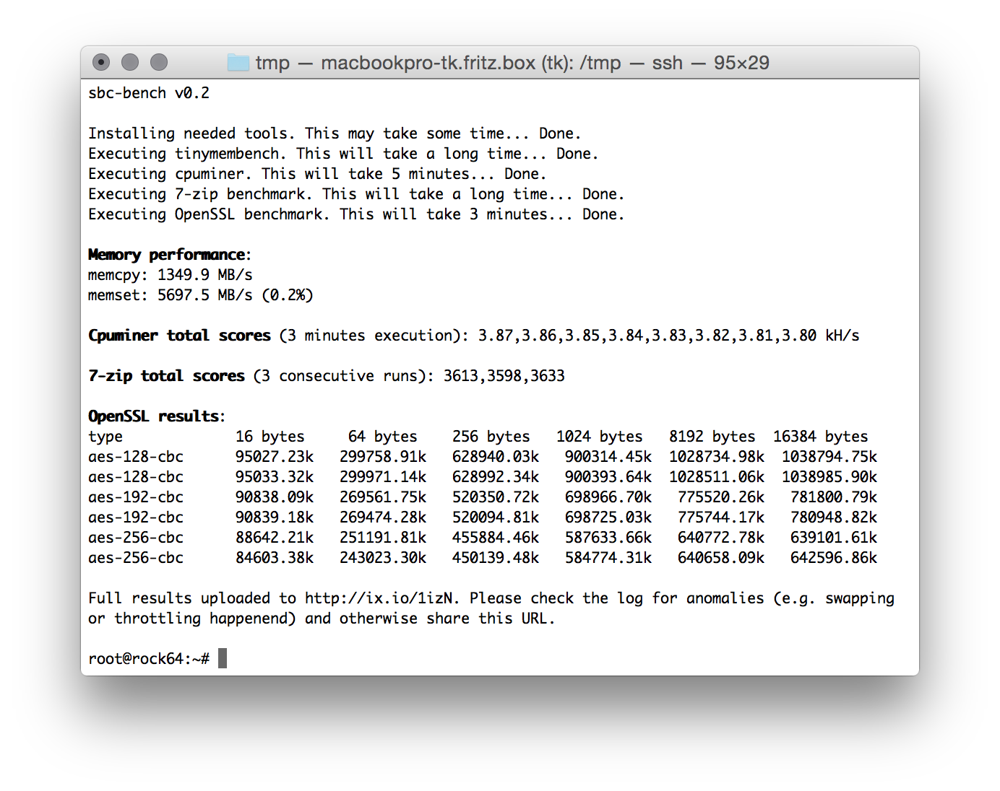

# sbc-bench

This small set of different CPU performance tests focuses on 'headless' operation only (no GPU/display stuff, no floating point number crunching). Unlike many other 'kitchen-sink benchmarks' it tries to produce insights instead of fancy graphs.

It has two **entirely different** usage modes:

* Generate a rough CPU performance assessment for a specific SBC *in general* (under ideal conditions)
* Show whether an *individual* SBC is able to perform the same and if not hopefully answering the question 'why?'

The SoCs (system-on-chip) used on today's SBC are that performant that heat dissipation when running full load for some time becomes an issue. The strategies to deal with the problem differ by platform and kernel. We've seen CPU cores being shut down when overheating (Allwinner boards running with original Allwinner software), we know platforms where throttling works pretty well but by switching to a different kernel performance is trashed on exactly the same hardware. Sometimes it's pretty easy to spot what's going on, sometimes vendors cheat on us and it takes some efforts to get a clue what's really happening.

This tool therefore focuses on a controlled environment and intensive monitoring running in the background and being added to results output. The tool returns with a brief performance overview (see screenshot above) but the real information will be uploaded to an online pasteboard service ([RockPro64 example](http://ix.io/1iA6)). Without checking this detailed output numbers are worthless (since we always need to check what really happened).

## Execution

You need an armhf or arm64 Debian Stretch or Ubuntu Bionic install. Older variants are not supported (due to distro packages being way too outdated). Then it's

    wget https://raw.githubusercontent.com/ThomasKaiser/sbc-bench/master/sbc-bench.sh
	sudo /bin/bash ./sbc-bench.sh neon

Unfortunately to adjust the cpufreq governor and to collect monitoring data execution as root is needed. So do **not** run this on productive systems or if you don't understand what the script is doing.

## Which tools are used and why?

I chose [tinymembench](https://github.com/ssvb/tinymembench), [cpuminer](https://github.com/tkinjo1985/cpuminer-multi.git), [7-zip](https://www.7-cpu.com) and [OpenSSL](https://www.openssl.org)'s AES benchmarks for the following reasons:

### [tinymembench](https://github.com/ssvb/tinymembench)

Unlike other 'RAM benchmarks' *tinymembench* checks for both memory bandwidth and latency in a lot of variations. It also measures multiple times and if sample standard deviation exceeds 0.1%, it is shown in brackets next to the result. So it's pretty easy to spot background activity ruining benchmark results.

On big.LITTLE systems we pin execution one time to a little and one time to a big core to know the difference this makes. For the sake of simplicity we output *memcpy* and *memset* numbers at the end of the benchmark. On an *overclocked* RPi 3 B+ (arm_freq=1570, over_voltage=4, core_freq=500, sdram_freq=510, over_voltage_sdram=2) this will look like this

    Memory performance:
    memcpy: 1316.0 MB/s (0.8%)
    memset: 1933.9 MB/s

On a NanoPC T4 (RK3399, 2xA72/4xA53 CPU cores) this will look like this with mainline kernel and conservative settings *without any optimizations* yet:

    Memory performance:
    memcpy: 2054.9 MB/s
    memset: 8453.0 MB/s (0.2%)
    memcpy: 4238.8 MB/s (0.4%)
    memset: 9082.5 MB/s (0.9%)

*(first two lines show execution on a little A53 core, the last ones when pinned to an A72 big core)*

On ARM SoCs CPU and GPU/VPU usually share memory access so it's worth a try to experiment with disabling HDMI/GPU for headless use cases. Often memory bandwidth and therefore overall performance increases. Same when switching between kernel branches.

### [cpuminer](https://github.com/tkinjo1985/cpuminer-multi.git)

This is the most demanding benchmark of the four and pretty efficient to check for appropriate heat dissipation and even instabilities under load. It makes heavy use of NEON optimizations therefore generating more heat than unoptimized 'standard' code.

Heavy NEON optimizations aren't really common and therefore this test is optional. Unless you execute `sbc-bench neon` it will be skipped since results can be misleading. So consider this being a load generator to check whether your board will start to throttle or becomes unstable but take the benchmark numbers with a grain of salt unless you're a programmer and know what [NEON](https://en.wikipedia.org/wiki/ARM_architecture#Advanced_SIMD_(NEON)) really is and whether your application can make use of.

A typical result (Rock64 with Armbian/Stretch) will look like this:

    Cpuminer total scores (5 minutes execution): 3.87,3.86,3.85,3.84,3.83,3.82,3.81,3.80 kH/s

*(sample standard deviation in this case is ok since all results are more or less the same. If the board would've started throttling the later numbers are much lower than the first ones)*

### [7-zip](https://www.7-cpu.com)

7-zip's internal benchmark mode is a pretty good representation of 'server workloads in general'. It doesn't utilize CPU cores fully (at least not on ARM, on Intel with Hyperthreading it's a different story) and it depends somewhat on memory performance and amount of available memory. When running fully parallel on systems that have many cores but are low on memory we see just as in reality the kernel either killing processes due to 'out of memory' or starting to swap if configured.

On big.LITTLE systems we start with one run pinned to a little core followed by one pinned to a big core. Then follow 3 consecutive runs using all available cores. The results might look like this:

    7-zip total scores (3 consecutive runs): 3313,3285,3050
    7-zip total scores (3 consecutive runs): 3613,3598,3633
    7-zip total scores (3 consecutive runs): 7382,7407,7426

*(this is a RPi 3 B+ with [latest firmware update applied destroying performance](https://www.raspberrypi.org/forums/viewtopic.php?f=63&t=217056) showing throttling symptoms followed by a Rock64 at 1.4GHz with Armbian standard settings passively cooled by small heatsink followed by an octa-core NanoPi Fire3 also at 1.4 GHz but with heatsink and fan this time)*

### [OpenSSL](https://www.openssl.org)

This test solely focuses on AES performance (VPN use case, full disk encryption). The test tries to quickly confirm whether an ARM SoC can make use of special encryption engines. Some SoC vendors don't care, some add proprietary crypto engines to their SoCs (Marvell's CESA for example), some vendors chose to license ARM's 'ARMv8 Crypto Extensions'. So in case a board runs with an 64-bit ARM SoC this simple test shows the presence of a crypto engine or not.

Results might look like this on an *overclocked* Raspberry Pi 3 B+ at 1570 MHz [lacking any crypto acceleration](https://www.raspberrypi.org/forums/viewtopic.php?t=207888#p1333029):

    type             16 bytes     64 bytes    256 bytes   1024 bytes   8192 bytes
    aes-128-cbc      39393.73k    54173.16k    60220.67k    61720.92k    62518.61k
    aes-192-cbc      35676.65k    46311.68k    51358.21k    52840.11k    53157.89k
    aes-256-cbc      33339.62k    42962.13k    46476.37k    47619.07k    47925.93k

Vs. an Orange Pi Zero Plus based on Allwinner H5 heavily *underclocked* at just 816 MHz:

    type             16 bytes     64 bytes    256 bytes   1024 bytes   8192 bytes
    aes-128-cbc     102568.41k   274205.76k   458456.23k   569923.58k   613422.42k
    aes-192-cbc      95781.66k   235775.72k   366295.72k   435745.79k   461294.25k
    aes-256-cbc      91725.44k   211677.08k   313433.77k   362907.31k   380482.90k

ARMv8 Crypto Extensions make the difference here. Even at almost half the CPU clockspeed with small data chunks at least 2.5 times faster and up to 9 times faster with larger chunks. Looking at different chunk sizes makes a lot of sense since some proprietary crypto engines suffer from high initialization overhead. See these numbers for a Banana Pi R2 based on a MediaTek MT7623 with proprietary crypto engine after compiling own kernel and OpenSSL ([sources](https://forum.armbian.com/topic/4583-rock64/?do=findComment&comment=37829)):

    type             16 bytes     64 bytes    256 bytes   1024 bytes   8192 bytes
    aes-128-cbc        519.15k     1784.13k     6315.78k    25199.27k   124499.22k
    aes-192-cbc        512.39k     1794.01k     6375.59k    25382.23k   118693.89k
    aes-256-cbc        508.30k     1795.05k     6339.93k    25042.60k   112943.10k

## Interpreting results

*(coming soon)*

## Spotting problems

*(coming soon)*
